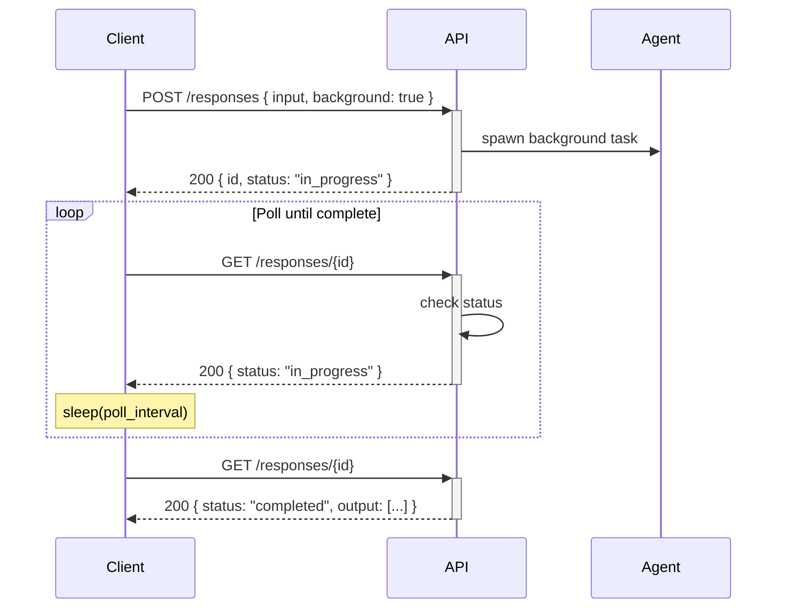
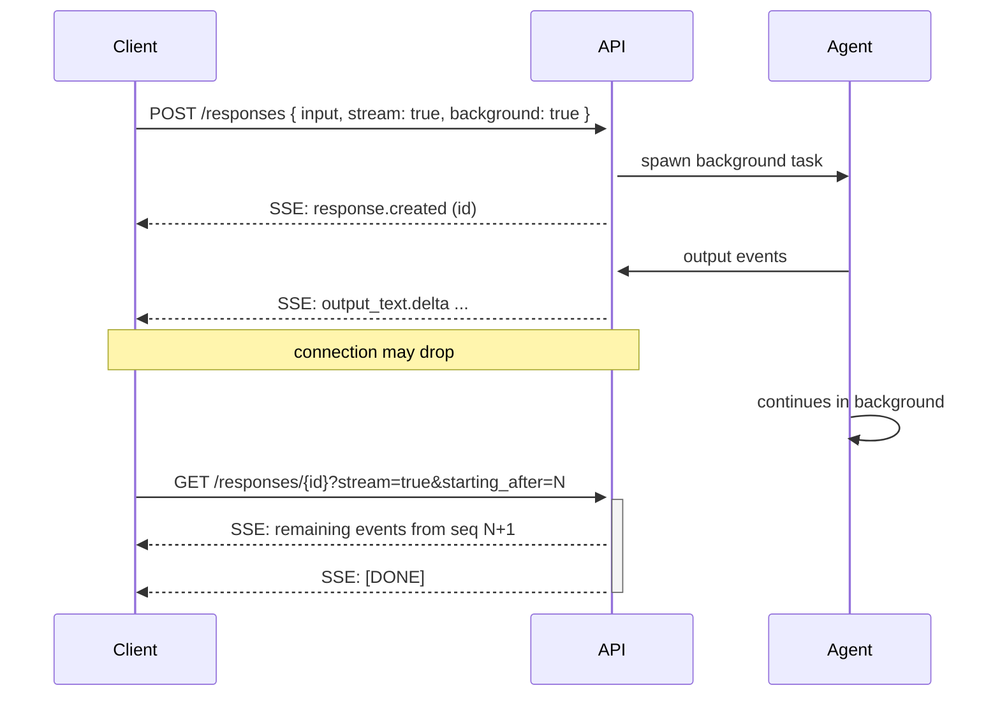
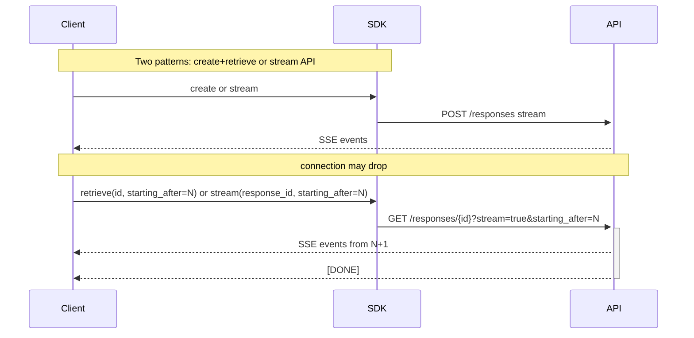

# Long-Running Responses API Agent

This project is a **fork and extension** of the [Databricks agent-openai-agents-sdk template](https://github.com/databricks/app-templates/tree/main/agent-openai-agents-sdk). It adds support for long-running agent queries, background execution, and persistence—enabling use cases where agent responses take minutes rather than seconds (e.g., multi-turn tool execution, complex code generation).

## Purpose and Differences from the Reference

| Aspect | Reference Template | This Implementation |
|--------|--------------------|---------------------|
| **Request handling** | Synchronous: POST blocks until response is complete | **Background mode**: `background=true` returns `response_id` immediately; client polls/streams via GET `/responses/{id}` |
| **Persistence** | None | **Lakebase (PostgreSQL)** stores stream events so clients can resume or poll results |
| **Server** | Standard MLflow `AgentServer` | **`LongRunningAgentServer`** extends `AgentServer` with background mode and retrieve endpoints |

The agent still implements the [OpenAI Responses API](https://platform.openai.com/docs/api-reference/responses) interface and uses MLflow's ResponsesAgent format. Standard synchronous invoke/stream behavior is preserved when `background=false` (default).

## Build with AI Assistance

We recommend using AI coding assistants (Claude Code, Cursor, GitHub Copilot) to customize and deploy this template. Agent Skills in `.claude/skills/` provide step-by-step guidance for common tasks like setup, adding tools, and deployment. These skills are automatically detected by Claude, Cursor, and GitHub Copilot.

## Quick start

Run the `uv run quickstart` script to quickly set up your local environment and start the agent server. At any step, if there are issues, refer to the manual local development loop setup below.

This script will:

1. Verify uv, nvm, and Databricks CLI installations
2. Configure Databricks authentication
3. Configure agent tracing, by creating and linking an MLflow experiment to your app
4. Start the agent server and chat app

```bash
uv run quickstart
```

After the setup is complete, you can start the agent server and the chat app locally with:

```bash
uv run start-app
```

This starts the **agent backend** (FastAPI) on port 8000 and the **e2e-chatbot-app-next** frontend on port 3000. The frontend proxies chat requests to the agent via `API_PROXY`.

**Difference from reference:** The reference uses a simpler built-in chat. Here, `start-app` clones (if needed) and runs the full e2e-chatbot-app-next stack, which supports long-running queries via the chat proxy and extended timeouts.

**Next steps:** Run the [Python demo script](#python-demo-script) to test the API, or see [modifying your agent](#modifying-your-agent) to customize and iterate on the agent code.

## Manual local development loop setup

1. **Set up your local environment**
   Install `uv` (python package manager), `nvm` (node version manager), and the Databricks CLI:

   - [`uv` installation docs](https://docs.astral.sh/uv/getting-started/installation/)
   - [`nvm` installation](https://github.com/nvm-sh/nvm?tab=readme-ov-file#installing-and-updating)
     - Run the following to use Node 20 LTS:
       ```bash
       nvm use 20
       ```
   - [`databricks CLI` installation](https://docs.databricks.com/aws/en/dev-tools/cli/install)

2. **Set up local authentication to Databricks**

   In order to access Databricks resources from your local machine while developing your agent, you need to authenticate with Databricks. Choose one of the following options:

   **Option 1: OAuth via Databricks CLI (Recommended)**

   Authenticate with Databricks using the CLI. See the [CLI OAuth documentation](https://docs.databricks.com/aws/en/dev-tools/cli/authentication#oauth-user-to-machine-u2m-authentication).

   ```bash
   databricks auth login
   ```

   Set the `DATABRICKS_CONFIG_PROFILE` environment variable in your .env file to the profile you used to authenticate:

   ```bash
   DATABRICKS_CONFIG_PROFILE="<profile>"  # e.g. DEFAULT or your profile name
   ```

   **Option 2: Personal Access Token (PAT)**

   See the [PAT documentation](https://docs.databricks.com/aws/en/dev-tools/auth/pat#databricks-personal-access-tokens-for-workspace-users).

   ```bash
   # Add these to your .env file
   DATABRICKS_HOST="https://host.databricks.com"
   DATABRICKS_TOKEN="dapi_token"
   ```

   See the [Databricks SDK authentication docs](https://docs.databricks.com/aws/en/dev-tools/sdk-python#authenticate-the-databricks-sdk-for-python-with-your-databricks-account-or-workspace).

3. **Create and link an MLflow experiment to your app**

   Create an MLflow experiment to enable tracing and version tracking. This is automatically done by the `uv run quickstart` script.

   Create the MLflow experiment via the CLI:

   ```bash
   DATABRICKS_USERNAME=$(databricks current-user me | jq -r .userName)
   databricks experiments create-experiment /Users/$DATABRICKS_USERNAME/agents-on-apps
   ```

   Make a copy of `.env.example` to `.env` and update the `MLFLOW_EXPERIMENT_ID` in your `.env` file with the experiment ID you created. The `.env` file will be automatically loaded when starting the server.

   ```bash
   cp .env.example .env
   # Edit .env and fill in your experiment ID
   ```

   See the [MLflow experiments documentation](https://docs.databricks.com/aws/en/mlflow/experiments#create-experiment-from-the-workspace).

4. **Configure Lakebase for background mode (optional)**

   **Difference from reference:** Background mode requires a Lakebase database to persist stream events. If `LAKEBASE_INSTANCE_NAME` is not set, the server runs without background mode; standard invoke/stream still work.

   For local development with background mode, configure your `.env` with Lakebase connection details (e.g., from a local or dev Lakebase instance).

5. **Test your agent locally**

   Start up the agent server and chat UI locally:

   ```bash
   uv run start-app
   ```

   Query your agent via the UI (http://localhost:3000) or REST API (http://localhost:8000). See [Querying your agent](#querying-your-agent) for detailed request and response formats.

   **Advanced server options:**

   ```bash
   uv run start-server --reload   # hot-reload the server on code changes
   uv run start-server --port 8001 # change the port the server listens on
   uv run start-server --workers 4 # run the server with multiple workers
   ```

## Querying your agent

The server exposes two endpoint families for compatibility. For a quick test, run the [Python demo script](#python-demo-script) (`uv run python scripts/demo_long_running_agent.py stream`).

| Concept | MLflow standard | Official Responses API |
|---------|------------------|------------------------|
| **Create** | `POST /invocations` | `POST /responses` |
| **Retrieve** | `GET /retrieve/{id}` | `GET /responses/{id}` |

Both POST routes use the same handler. Both GET routes are aliases and return the same data. Use whichever matches your client (e.g., MLflow tooling vs OpenAI-style `client.responses.retrieve(id)`).

Replace `<base_url>` with `http://localhost:8000` for local development, or `<app-url.databricksapps.com>` for deployed apps (with `Authorization: Bearer <oauth token>`).

**Client contract:** For applications that call the REST API directly or use the OpenAI SDK, see [Client Contract for REST API](#client-contract-for-rest-api) below for request/response formats, SSE parsing, resume logic, and SDK implementation patterns.

### Synchronous mode (default)

Without `background=true`, the POST blocks until the agent finishes. No GET is needed.

**Streaming:**
```bash
curl -X POST <base_url>/invocations \
  -H "Content-Type: application/json" \
  -d '{ "input": [{ "role": "user", "content": "hi" }], "stream": true }'
```
Returns an SSE stream of events until completion.

**Non-streaming:**
```bash
curl -X POST <base_url>/invocations \
  -H "Content-Type: application/json" \
  -d '{ "input": [{ "role": "user", "content": "hi" }] }'
```
Returns JSON `{"output": [...]}` when done.

### Background mode (long-running queries)

With `background=true`, the POST returns immediately with a `response_id`. The agent runs in the background and persists events to Lakebase. The client must use GET to poll or stream results. Background mode requires a configured database (Lakebase).

#### Background + streaming

**POST** (streams from the same connection, Responses API compliant):
```bash
curl -X POST <base_url>/invocations \
  -H "Content-Type: application/json" \
  -d '{ "input": [{ "role": "user", "content": "hi" }], "stream": true, "background": true }'
```

- **Response:** SSE stream with `response.created` (full `response` object with `id`, `status`, etc.) followed by all events (`response.output_item.added`, `response.output_item.done`, etc.) on the same connection. Each event includes `sequence_number` for ordering. Stream ends with `[DONE]` when status is `completed` or `failed`.

**Resume:** If the connection drops, use GET with `starting_after` to resume from the last sequence number:
```bash
curl "<base_url>/responses/resp_xxx?stream=true&starting_after=5"
# Or: GET /retrieve/resp_xxx?stream=true&starting_after=5
```

#### Background + non-streaming

**Step 1 – POST** (returns immediately):
```bash
curl -X POST <base_url>/invocations \
  -H "Content-Type: application/json" \
  -d '{ "input": [{ "role": "user", "content": "hi" }], "background": true }'
```

- **Response:** JSON `{"id": "resp_xxx", "status": "in_progress"}`. Extract `id` for the next step.

**Step 2 – GET** (poll for completion):
```bash
curl "<base_url>/responses/resp_xxx"
# Or: GET /retrieve/resp_xxx (stream=false by default)
```

- **While running:** `{"id": "resp_xxx", "status": "in_progress"}`
- **When done:** `{"id": "resp_xxx", "status": "completed", "output": [...]}`

Poll repeatedly until `status` is `completed` or `failed`.

### Python demo script

The `scripts/demo_long_running_agent.py` script demonstrates the Responses API with background mode, streaming, polling, and reconnection. It uses `DatabricksOpenAI` (from `databricks-openai`) or plain `OpenAI` for local dev, mirroring the [OpenAI background streaming guide](https://developers.openai.com/api/docs/guides/background/#streaming-a-background-response). Output is rendered as formatted text in the terminal (not raw events).

**Examples:**

| Example | Description |
|---------|-------------|
| `poll` | Background + poll until completion (standard prompt) |
| `stream` | Background + stream from POST with reconnect support (standard prompt) |
| `stream --long` | Same as stream, but uses a prompt (14 iterations) designed to exceed the 120 second Databricks Apps connection limit, so the connection is likely to drop—realistically demonstrates stream resumption |
| `stream --stream-api` | Use `client.responses.stream()` instead of create+retrieve for both trigger and resume |
| `stream --no-cursor` | Resume without `starting_after`; streams all content again from start (no deduplication) |

**Usage:**

```bash
# Local agent (default http://localhost:8000, no auth required):
uv run python scripts/demo_long_running_agent.py stream

# With --long to demonstrate stream resumption (exceeds 120s Databricks Apps limit):
uv run python scripts/demo_long_running_agent.py stream --long

# Other examples:
uv run python scripts/demo_long_running_agent.py poll
uv run python scripts/demo_long_running_agent.py stream --stream-api
uv run python scripts/demo_long_running_agent.py --help
```

**Configuration:** `--url` (default `http://localhost:8000`), `--profile` for Databricks OAuth. For Databricks apps, use `--url https://<app-name>.aws.databricksapps.com` after running `databricks auth login`.

## Client Contract for REST API

This section describes the client contract for applications that interact with the long-running agent API—either directly via REST (e.g. JavaScript/TypeScript) or via the OpenAI SDK (e.g. Python). Any frontend or other client must implement this contract to support background mode and stream resumption.

### Overview

The flow supports two modes:

1. **Background + Poll** – POST returns immediately; client polls GET until completion.
2. **Background + Stream** – POST returns an SSE stream; client can resume via GET if the connection drops.

### Base URL and Authentication

| Environment | Base URL | Auth |
|-------------|----------|------|
| Local | `http://localhost:8000` | None required (server accepts any request) |
| Databricks App | `https://<app-name>.aws.databricksapps.com` | `Authorization: Bearer <oauth_token>` (e.g. from `databricks auth login`) |

Optional header for trace IDs:

- `x-mlflow-return-trace-id: true`

### Endpoints

| Operation | Path | Method |
|-----------|------|--------|
| Create | `/responses` or `/invocations` | POST |
| Retrieve | `/responses/{response_id}` or `/retrieve/{response_id}` | GET |

Both POST paths and both GET paths behave identically.

---

### Flow 1: Background + Poll



#### Step 1 – Create (POST)

**Request:**

```http
POST /responses HTTP/1.1
Content-Type: application/json

{
  "input": [{ "role": "user", "content": "Your prompt here" }],
  "background": true
}
```

**Response (200):**

```json
{
  "id": "resp_abc123def456789012345678",
  "object": "response",
  "created_at": 1730000000,
  "status": "in_progress",
  "error": null,
  "incomplete_details": null,
  "output": [],
  "metadata": {}
}
```

#### Step 2 – Poll (GET)

**Request:**

```http
GET /responses/resp_abc123def456789012345678
```

**Response while running (200):**

```json
{
  "id": "resp_abc123def456789012345678",
  "status": "in_progress"
}
```

**Response when completed (200):**

```json
{
  "id": "resp_abc123def456789012345678",
  "status": "completed",
  "output": [
    {
      "type": "message",
      "role": "assistant",
      "content": [
        { "type": "output_text", "text": "The assistant's response..." }
      ]
    }
  ],
  "metadata": { "trace_id": "optional-trace-id" }
}
```

**Response on failure (200):**

```json
{
  "id": "resp_abc123def456789012345678",
  "status": "failed"
}
```

**Client logic (pseudo-code):**

```
response = POST /responses with { input, background: true }
responseId = response.id

loop:
  result = GET /responses/{responseId}
  if result.status != "in_progress":
    return result   // completed or failed
  sleep(poll_interval)   // e.g. 2 seconds
```

#### Implementing with the OpenAI SDK

```mermaid
sequenceDiagram
    participant Client
    participant SDK
    participant API

    Client->>SDK: create(input=..., background=True)
    SDK->>+API: POST /responses
    API-->>-SDK: 200 { id, status }
    SDK-->>Client: Response(id, status)

    loop Poll until complete
        Client->>SDK: retrieve(id)
        SDK->>+API: GET /responses/{id}
        API-->>-SDK: 200 { status }
        SDK-->>Client: Response
        Note over Client: sleep; retry if in_progress
    end

    SDK-->>Client: Response(status: completed, output)
```

```python
resp = client.responses.create(input=[{"role": "user", "content": "..."}], background=True)
while resp.status in ("queued", "in_progress"):
    time.sleep(2)
    resp = client.responses.retrieve(resp.id)
# resp.output contains final result when status is "completed"
```

Run with: `uv run python scripts/demo_long_running_agent.py poll`

---

### Flow 2: Background + Stream



#### Step 1 – Create (POST with stream)

**Request:**

```http
POST /responses HTTP/1.1
Content-Type: application/json

{
  "input": [{ "role": "user", "content": "Your prompt here" }],
  "stream": true,
  "background": true
}
```

**Response:** `Content-Type: text/event-stream` (SSE)

#### SSE Event Format

Per [Open Responses](https://www.openresponses.org/specification), each event includes an `event:` line matching the `type` in the body, followed by `data:`:

```
event: response.created
data: {"type":"response.created","response":{...},"sequence_number":0}

event: response.output_item.added
data: {"type":"response.output_item.added","item":{...},"sequence_number":1}

event: response.output_text.delta
data: {"type":"response.output_text.delta","delta":"Hello","sequence_number":2}

event: response.output_item.done
data: {"type":"response.output_item.done","item":{...},"sequence_number":3}

data: [DONE]
```

Errors use `event: error` with a structured payload: `{"error":{"message":"...","type":"not_found","code":"response_not_found"}}`.

**Event types:**

| `type` | Purpose |
|--------|---------|
| `response.created` | Initial event with `response.id` and `response.status` |
| `response.output_item.added` | New output item started |
| `response.output_text.delta` | Text chunk (`delta` string) |
| `response.output_item.done` | Output item finished |
| `trace_id` | Optional; present when `x-mlflow-return-trace-id: true` |

#### Step 2 – Resume (GET when connection drops)

If the stream ends without `[DONE]`, resume with:

```http
GET /responses/{response_id}?stream=true&starting_after={last_sequence_number}
```

**Query parameters:**

| Param | Type | Default | Description |
|-------|------|---------|-------------|
| `stream` | boolean | `false` | `true` for SSE stream |
| `starting_after` | number | `0` | Resume after this `sequence_number` |

**Client logic (pseudo-code):**

```
// Initial request
stream = POST /responses with { input, stream: true, background: true }
responseId = null
lastSeq = 0

for each SSE event in stream:
  if event.response.id: responseId = event.response.id
  if event.sequence_number != null: lastSeq = event.sequence_number
  process(event)
  if event == "[DONE]": done

// If connection dropped before [DONE], resume
if responseId != null and not done:
  stream = GET /responses/{responseId}?stream=true&starting_after={lastSeq}
  for each SSE event in stream:
    process(event)
    if event == "[DONE]": done
```

#### Implementing with the OpenAI SDK

Two equivalent patterns are supported:

1. **create + retrieve**: Initial trigger: `client.responses.create(input=[...], background=True, stream=True)`. On connection drop, resume with `client.responses.retrieve(response_id, stream=True, starting_after=last_seq)`. Run with `uv run python scripts/demo_long_running_agent.py stream`.
2. **stream() API**: Initial trigger: `client.responses.stream(input=[...], model="agent", background=True)`. On resume: `client.responses.stream(response_id=id, starting_after=last_seq)`. Run with `uv run python scripts/demo_long_running_agent.py stream --stream-api`.

For both: track `sequence_number` from each event; pass `starting_after=last_seq` for deduplication on resume. Omit `starting_after` to stream all content again from start (no deduplication; use `--no-cursor` in demo). The demo uses tenacity for automatic retry on connection errors; clients should implement similar reconnect logic.

**`--long` option:** Uses a prompt (14 iterations) designed to exceed the 120 second Databricks Apps connection limit, so the connection is likely to drop during streaming. This realistically demonstrates stream resumption via `retrieve(stream=True, starting_after=N)` or `stream(response_id=..., starting_after=N)`. Run with `uv run python scripts/demo_long_running_agent.py stream --long`.



---

### Summary

| Flow | POST body | POST response | GET usage |
|------|-----------|---------------|-----------|
| Poll | `{ input, background: true }` | JSON with `id`, `status: "in_progress"` | Poll until `status !== "in_progress"` |
| Stream | `{ input, stream: true, background: true }` | SSE stream | Resume with `?stream=true&starting_after=N` if connection drops |

### References

- Server implementation: `agent_server/long_running_server.py`
- Python demo script: `scripts/demo_long_running_agent.py`
- E2E chatbot provider (reconnect logic): `e2e-chatbot-app-next/packages/ai-sdk-providers/src/providers-server.ts`
- [OpenAI background streaming guide](https://developers.openai.com/api/docs/guides/background/#streaming-a-background-response)
- See also [docs/Client-Contract-REST-API.md](docs/Client-Contract-REST-API.md) for a standalone specification document.

## Modifying your agent

See the [OpenAI Agents SDK documentation](https://platform.openai.com/docs/guides/agents-sdk) for more information on how to edit your own agent.

Key files for this implementation:

- `agent_server/agent.py`: Agent logic, model, MCP server setup, and `@invoke`/`@stream` handlers. Model is configurable.
- `agent_server/long_running_server.py`: `LongRunningAgentServer` extending MLflow's `AgentServer` with background mode and retrieve endpoints.
- `agent_server/start_server.py`: Initializes `LongRunningAgentServer` with `enable_chat_proxy=True`, DB init, and token refresh.
- `agent_server/utils.py`: `sanitize_output_items`, `process_agent_stream_events`, MCP URL builder, OBO helpers.

**Difference from reference:** The reference uses `system.ai.python_exec` directly. Here, tools are provided via an MCP server (`system.ai` UC functions).

**Common customization questions:**

**Q: Can I add additional files or folders to my agent?**
Yes. Add additional files or folders as needed. Ensure the script within `pyproject.toml` runs the correct script that starts the server and sets up MLflow tracing.

**Q: How do I add dependencies to my agent?**
Run `uv add <package_name>` (e.g., `uv add "mlflow-skinny[databricks]"`). See the [python pyproject.toml guide](https://packaging.python.org/en/latest/guides/writing-pyproject-toml/#dependencies-and-requirements).

**Q: Can I add custom tracing beyond the built-in tracing?**
Yes. This template uses MLflow's agent server, which comes with automatic tracing for agent logic decorated with `@invoke()` and `@stream()`. It also uses [MLflow autologging APIs](https://mlflow.org/docs/latest/genai/tracing/#one-line-auto-tracing-integrations) to capture traces from LLM invocations. However, you can add additional instrumentation to capture more granular trace information when your agent runs. See the [MLflow tracing documentation](https://docs.databricks.com/aws/en/mlflow3/genai/tracing/app-instrumentation/).

**Q: How can I extend this example with additional tools and capabilities?**
This template can be extended by integrating additional MCP servers, Vector Search Indexes, UC Functions, and other Databricks tools. See the ["Agent Framework Tools Documentation"](https://docs.databricks.com/aws/en/generative-ai/agent-framework/agent-tool).

## Evaluating your agent

Evaluate your agent by calling the invoke function you defined for the agent locally.

- Update your `evaluate_agent.py` file with the preferred evaluation dataset and scorers.

Run the evaluation using the evaluation script:

```bash
uv run agent-evaluate
```

After it completes, open the MLflow UI link for your experiment to inspect results.

**Note:** The evaluation script uses the standard `@invoke` function. If your agent relies on background mode or streaming-specific behavior, ensure your evaluation dataset and scorers are compatible. See `todo.md` for planned review of the evaluation script for this implementation.

## Deploying to Databricks Apps

**Difference from reference:** This project uses **Databricks Asset Bundles (DAB)** instead of `databricks sync` and `databricks apps deploy`. The bundle provisions the Lakebase database, MLflow experiment, and app in one workflow.

0. **Prerequisites**
   Ensure you have the [Databricks CLI](https://docs.databricks.com/aws/en/dev-tools/cli/tutorial) installed and configured. Authenticate with your target profile:

   ```bash
   databricks auth login
   export DATABRICKS_CONFIG_PROFILE=<profile>  # your Databricks config profile
   ```

1. **Configure the bundle**

   Edit `databricks.yml` to set your target workspace and, if needed, the Lakebase instance name. The bundle creates the database instance, MLflow experiment, and app automatically.

2. **Deploy and run**

   See the [deploy skill](.claude/skills/deploy/SKILL.md) for full details. Summary:

   ```bash
   databricks bundle validate
   databricks bundle deploy -p <profile>
   databricks bundle run agent_openai_agents_sdk -p <profile>
   ```

   > **Note:** `bundle deploy` uploads files and configures resources. `bundle run` is required to start/restart the app with the new code.

3. **Set up authentication to Databricks resources**

   The bundle grants the app access to the MLflow experiment and Lakebase database. For additional resources (serving endpoints, Genie spaces, UC Functions, Vector Search Indexes), add them to `databricks.yml` under the app's `resources` section. See the [Databricks Apps resources documentation](https://docs.databricks.com/aws/en/dev-tools/databricks-apps/resources).

   **On-behalf-of (OBO) User Authentication**: Use `get_user_workspace_client()` from `agent_server.utils` to authenticate as the requesting user instead of the app service principal. See the [OBO authentication documentation](https://docs.databricks.com/aws/en/dev-tools/databricks-apps/auth?language=Streamlit#retrieve-user-authorization-credentials).

4. **Grant Lakebase permissions to your App's Service Principal**

   Before deploying or querying your agent, ensure your app has access to the necessary Lakebase schemas and tables. Add your Lakebase instance as a resource to your app (Databricks UI → your app → Edit → App resources → Add resource → Lakebase instance). Then run the following SQL on your Lakebase instance (e.g. via Databricks SQL or Lakebase UI). Replace `YOUR_APP_SERVICE_PRINCIPAL_ID` with your app's service principal UUID (from the app Edit page in Databricks UI):

   ```sql
   DO $$
   DECLARE
      app_sp text := 'YOUR_APP_SERVICE_PRINCIPAL_ID';  -- Replace with your App's Service Principal UUID
   BEGIN
      -------------------------------------------------------------------
      -- Drizzle schema: migration metadata
      -------------------------------------------------------------------
      EXECUTE format('GRANT USAGE, CREATE ON SCHEMA drizzle TO %I;', app_sp);
      EXECUTE format('GRANT SELECT, INSERT, UPDATE ON ALL TABLES IN SCHEMA drizzle TO %I;', app_sp);

      -------------------------------------------------------------------
      -- agent_server schema: agent backend tables
      -------------------------------------------------------------------
      EXECUTE format('GRANT USAGE, CREATE ON SCHEMA agent_server TO %I;', app_sp);
      EXECUTE format('GRANT SELECT, INSERT, UPDATE ON ALL TABLES IN SCHEMA agent_server TO %I;', app_sp);

      -------------------------------------------------------------------
      -- ai_chatbot schema: Chat, Message, User
      -------------------------------------------------------------------
      EXECUTE format('GRANT USAGE, CREATE ON SCHEMA ai_chatbot TO %I;', app_sp);
      EXECUTE format('GRANT SELECT, INSERT, UPDATE ON ALL TABLES IN SCHEMA ai_chatbot TO %I;', app_sp);

      -------------------------------------------------------------------
      -- public schema: checkpoint tables
      -------------------------------------------------------------------
      EXECUTE format('GRANT USAGE, CREATE ON SCHEMA public TO %I;', app_sp);
      EXECUTE format('GRANT SELECT, INSERT, UPDATE ON ALL TABLES IN SCHEMA public TO %I;', app_sp);
   END $$;
   ```

5. **Query your agent hosted on Databricks Apps**

   Databricks Apps are _only_ queryable via OAuth token. You cannot use a PAT to query your agent. Generate an [OAuth token with your credentials using the Databricks CLI](https://docs.databricks.com/aws/en/dev-tools/cli/authentication#u2m-auth):

   ```bash
   databricks auth token
   ```

   Use the same endpoints and flows as in [Querying your agent](#querying-your-agent), with:
   - `<base_url>` = your app URL (e.g. `https://<app-name>.databricksapps.com`)
   - Header: `Authorization: Bearer <oauth token>` on every request

   Example (synchronous streaming):
   ```bash
   curl -X POST https://<app-name>.databricksapps.com/invocations \
     -H "Authorization: Bearer $(databricks auth token)" \
     -H "Content-Type: application/json" \
     -d '{ "input": [{ "role": "user", "content": "hi" }], "stream": true }'
   ```

   For background mode, POST with `background: true`, then GET `/responses/<response_id>` (or `/retrieve/<response_id>`) with the same auth header. See the [Querying your agent](#querying-your-agent) section for the full flow.

For future updates to the agent, run `databricks bundle deploy -p <profile>` and `databricks bundle run agent_openai_agents_sdk -p <profile>` again.

### FAQ

- For a streaming response, I see a 200 OK in the logs, but an error in the actual stream. What's going on?
  - This is expected behavior. The initial 200 OK confirms stream setup; streaming errors don't affect this status.
- When querying my agent, I get a 302 error. What's going on?
  - Use an OAuth token. PATs are not supported for querying agents.
- Background mode returns immediately but I get no results when polling. What's wrong?
  - Ensure the Lakebase database is configured (`LAKEBASE_INSTANCE_NAME` set) and that the app has the database resource bound in `databricks.yml`. The `LAKEBASE_INSTANCE_NAME` is injected via `valueFrom: "database"` from the database resource; ensure `instance_name` in the database resource matches your Lakebase instance.
